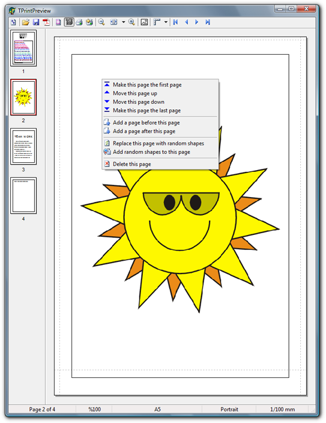
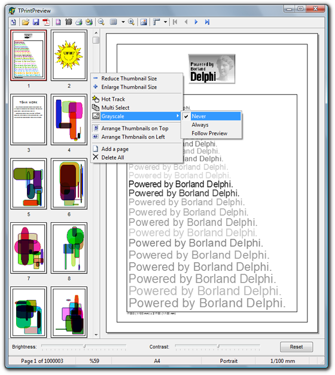
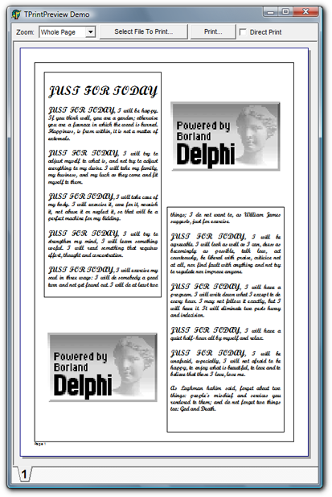

Description
===========
The print preview components consist of three visual components for low level print and print preview on the Windows target platform.

- **[TPrintPreview](Docs/TPrintPreview.md)** \
  This control acts as a printer replacement to generate, display, manipulate, and print pages.

  

- **[TThumbnailPreview](Docs/TThumbnailPreview.md)** \
  This control shows the list of pages generated by a [TPrintPreview](Docs/TPrintPreview.md) component as thumbnails.

  

- **[TPaperPreview](Docs/TPaperPreview.md)** \
  This control represents a sheet of paper that an application can draw directly on its canvas.

  

All the print preview components are fully customizable and have a comprehensive set of properties and events.

Installation
============
Add the following file into a new or existing package:

- `Preview.pas`

The following packages must be added to the requires clause of your package:

- `VCL`
- `RTL` (for Delphi 6 or higher only)
- `DesignIDE` (for design-time package of Delphi 6 or higher only)

Ensure `Preview.pas` and `DELPHIAREA.INC` files are in the search path of your Delphi installation.

PDF Support
===========
The [TPrintPreview](Docs/TPrintPreview.md) control relies on third-party libraries for saving pages as PDF document. Currently, the control can use two libraries for this purpose.

### Synopse PDF Engine
Synopse PDF engine is an open source PDF document creation library for Delphi. You can find the source code of the library at https://github.com/synopse/SynPDF.

To instruct the [TPrintPreview](Docs/TPrintPreview.md) control to use this library as the PDF generator, define the `SYNOPSE` compiler directive at the beginning of the `Preview.pas` file.

### dsPDF Library
The dsPDF library is a postcard-ware. To get the non-demo version of this library, you should send the author (Grega Loboda) a postcard of the town or city you live.

The demo version of the library is provided in the `Examples\General` folder of this repository. The demo version displays "This is demo" message upon initialization, and does not save document's properties.
